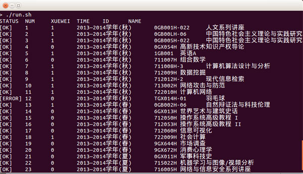

UCAS-HELPER
===

在中科院学习过程中编写的一些自动化工具:)

douban2ucas
---

豆瓣读书关联中科院图书馆

<https://github.com/zhangxiaoyang/douban2ucas>

UCAS\_XUANKE
---

刷课工具，捡漏神器（Chrome插件）

<https://github.com/zhangxiaoyang/UCAS_XUANKE>

peiyang
---

自动填写SEP系统的培养计划（需要手动设置COOKIE）

<https://github.com/zhangxiaoyang/ucas-helper/tree/master/peiyang>

### 使用说明：（Linux）
STEP 1：`git clone https://github.com/zhangxiaoyang/ucas-helper && cd ucas-helper/peiyang`

STEP 2：在`run.sh`中填入自己的COOKIE
（需要先用浏览器登录系统，再依次进入`选课系统`和`培养指导`系统，并记录下3个COOKIE值，依次填入run.sh中，详情请看run.sh头部的3个变量）

STEP 3：执行命令`./run.sh`或`bash run.sh`，然后就可以等待程序自动填写啦:)

License
---

MIT
